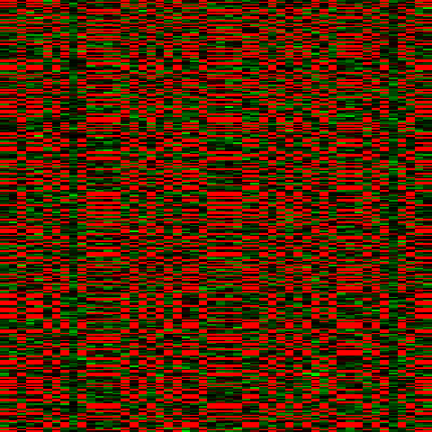
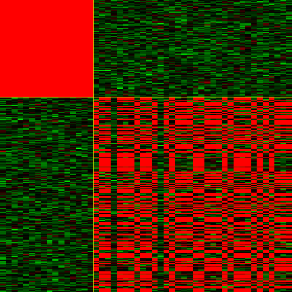
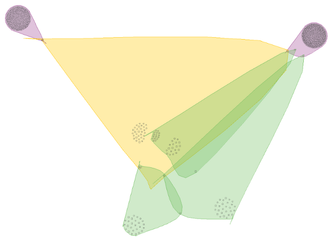

===========
Quick start
===========

Import bibench like any Python module::

    >>> import bibench

If the import fails, make sure that BiBench is on your PYTHONPATH.

BiBench contains many submodules, but to save time you can use the
``bibench.all`` module, which imports the most useful functions into
one place::

    >>> import bibench.all as bb

++++++++++++++++++++++
Synthetic data example
++++++++++++++++++++++

First we need a dataset on which to run our biclustering
algorithms. BiBench can generate synthetic data for testing
purposes. Here we make a dataset with upregulated biclusters::

    >>> data, expected = bb.make_const_data(bicluster_signals=[5,5,5], shuffle=True)

The list of hidden biclusters, ``expected``, will be useful later to
see how well an algorithm has done. The dataset is a standard
numpy.ndarray, so we can do all the usual things like examine its
shape::

    >>> data.shape
    (300, 50)

BiBench supports visualizing data and biclusters in various ways. We
can also view a heatmap of the data::

    >>> bb.heatmap(data)

We can also sort the dataset so that the first expected bicluster is
contiguous::

    >>> bb.heatmap(data, expected[0], local=False)

Now we want to cluster the dataset using BiMax. But BiMax requires
that the data be binarized. We use QUBIC's method of discretization
to make this dataset binary::

    >>> bin_data = bb.qubic_binarize_up(data)

Now we can cluster the dataset and see how well BiMax did::

    >>> found = bb.bimax(bin_data)
    >>> bb.jaccard_list(expected, found)
    ListScore(relevance=0.055462621590093929, recovery=1.0)

It looks like BiMax found all the biclusters, but also found lots of
extra ones that are hurting its relevance score. The ``filter``
function is useful in this case; here filter out small biclusters::

    >>> filtered = bb.filter(found, minrows=5, mincols=5)
    >>> bb.jaccard_list(expected, filtered)
    ListScore(relevance=1.0, recovery=1.0)

Note that ``filter`` also removes duplicate biclusters.

++++++++++++++++++++++++++++
Bioconductor data example
++++++++++++++++++++++++++++
    
Now let's try clustering a real microarray dataset. If rpy2, R, and
Bioconductor are installed, we have access to all of the functionality
of Bioconductor, including lots of datasets. A list of all experiment
data packages is available `here
<http://bioconductor.org/packages/release/data/experiment/>`_. (It is
also possible to get a list interactively. See rpy2's `documentation
for interactive work
<http://rpy.sourceforge.net/rpy2/doc-2.2/html/interactive.html>`_)

Let's install the ALL data, which consists of 128 microarrays from
patients with acute lymphoblastic leukemia (ALL). We first need to get
the bioclite command, which requires an internet connection::

    >>> bioclite = bibench.rutil.get_bioclite()
    >>> bioclite('ALL')

Now that the data is installed, we can get it::    

    >>> data = bb.get_bioc_data('ALL')

Gene expression data files have labelled rows (genes/probes) and
columns (samples). We can access them as members of our data. Here we
have Affymetrix probes for our row labels::

    >>> data.genes[0:3]
    ['1000_at', '1001_at', '1002_f_at']
    
    >>> data.samples[0:3]
    ['01005', '01010', '03002']

This time we use QUBIC for clustering::

    >>> found = bb.qubic(data)

Since this is a real dataset, the true biclusters are
unknown. However, we can do `Gene Ontology
<http://www.geneontology.org/>`_ enrichment analysis on each
bicluster. Since this dataset was obtained from Bioconductor, we can
find which annotation package to use by simply examing the
``annotation`` attribute::

    >>> data.annotation
    'hgu95av2'

We check the biclusters for enriched Gene Ontology terms, using
the datasets probes as the gene universe::

    >>> enriched = [bb.enrichment(f, data.annotation, data.genes) for f in found]
    >>> enriched[0]

It is easy to get a GO id's full annotation. For instance, suppose we
wanted to get `GO:0048870
<http://amigo.geneontology.org/cgi-bin/amigo/term-details.cgi?term=GO:0048870>`_'s
full annotation::

    >>> bb.goid_annot('GO:0048870')
    GoAnnot(goid='GO:0048870',
            term='cell motility',
	    ontology='BP',
	    synonym=None,
	    secondary=None,
	    definition='Any process involved in the controlled self-propelled movement of a cell that results in translocation of the cell from one place to another.')

Then using ``bb.goid_annot`` we can get the first bicluster's actual
enriched terms::

    >>> [annot.term for annot in [bb.goid_annot(e.goid) for e in enriched[0]]]
    ['cardiovascular system development',
     'blood vessel development',
     'extracellular matrix organization',
     'muscle tissue development',
     'cell adhesion',
     'collagen fibril organization',
     'muscle organ development',
     'cell motility',
     'muscle contraction',
     'angiogenesis']

Finally, we export the first six biclusters in the `BicOverlapper
<http://vis.usal.es/bicoverlapper/>`_ format, to allow visualization
using the BicOverlapper visualization tool::

    >>> bb.write_bicoverlapper([found[0:6]], './all-data-qubic-biclusters.txt', data.genes, data.samples)

After importing the result and choosing the Overlapper view, this is the result:

Clearly these biclusters do not overlap much.

+++++++++++++++++++
GDS data example
+++++++++++++++++++

The `Gene Expression Omnibus <http://www.ncbi.nlm.nih.gov/geo/>`_ is a
handy resource for expression data. BiBench provides an interface to
the `geometadb
<http://www.bioconductor.org/packages/2.2/bioc/html/GEOmetadb.html>`_
package, so we can query GEO metadata to find the appropriate
dataset. The first time this functionality is used, the SQLlite
database is automatically downloaded and stored in
``$HOME/.bibench/GEOmetadb.sqlite``.

Suppose we want to find a curated (GDS) dataset that was generated
from an Affymetrix chip::

    >>> bb.geo_query("select gds from gds join gpl on gds.gpl=gds.gpl where gpl.manufacturer='Affymetrix'")
    >>> len(result[0])
    2721

There are 2721 such GDS datasets. The result of our query is an rpy2.robjects.vectors.DataFrame, with
one column for each argument to ``select``::

    >>> type(result)
    rpy2.robjects.vectors.DataFrame

We examine the first five datasets::

    >>> result[0][0:5]
    <StrVector - Python:0x188f4bcc / R:0x13ce5458>
    ['GDS5', 'GDS6', 'GDS10', 'GDS12', 'GDS15']

BiBench can automatically download and import GDS datasets. Here we
get GDS3715::

    >>> data = bb.get_gds_data(3715)

The dataset is cached in ``$HOME/.bibench/gds``, so future calls to
``bb.get_gds_data(3715)`` will not download the whole dataset again.

Cluster the dataset using CPB::

    >>> found = bb.cpb(data, 10)

BiBench automatically maps a GDS dataset's GPL platform to the
appropriate Bioconducter annotation database, if possible. Let's make
sure it worked::

    >>> data.annotation
    'hgu95av2'

It did indeed work. So it is easy to perform a Gene Ontology
enrichment analysis::

    >>> enriched = [bb.enrichment(f, data.annotation, data.genes) for f in found]
